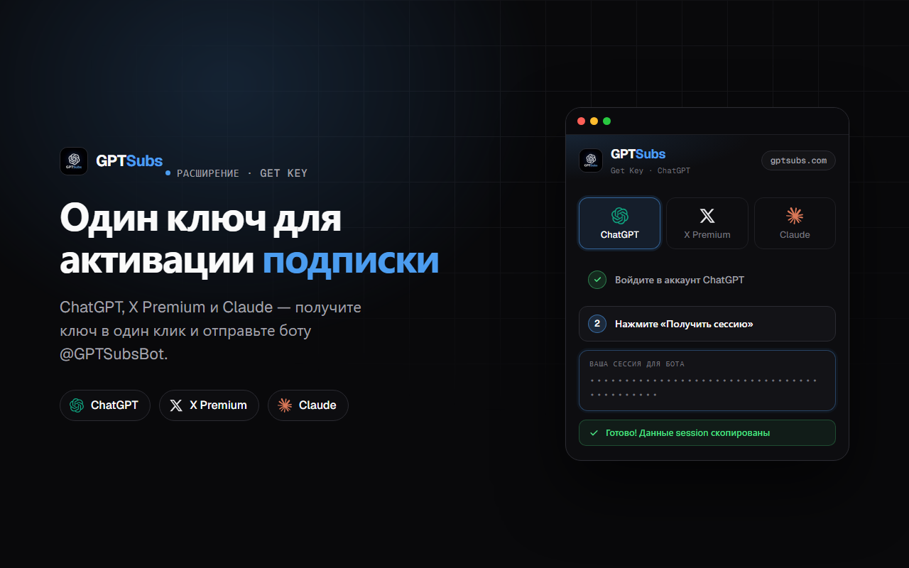

# GPTSubs — Get Key

Chrome-расширение для получения ключа аккаунта в один клик, чтобы активировать подписку через [@GPTSubsBot](https://t.me/GPTSubsBot).

## Поддерживаемые сервисы

| Сервис | Что получает |
|---|---|
| **ChatGPT** | сессия (`/api/auth/session`) для активации |
| **X (Twitter) Premium** | ID для оплаты |
| **Claude** | `sessionKey` |

## Как это работает

1. Откройте расширение и выберите нужный сервис — ChatGPT, X Premium или Claude.
2. Нажмите **«Получить»** — ключ считывается автоматически.
3. Ключ копируется в буфер обмена (для ChatGPT можно скачать файл `.txt`).
4. Отправьте ключ боту [@GPTSubsBot](https://t.me/GPTSubsBot) и завершите оплату.

## Установка

**Из Chrome Web Store:** _(ссылка появится после публикации)_

**Вручную (для разработки):**
1. Скачайте или склонируйте репозиторий.
2. Откройте `chrome://extensions`.
3. Включите **Режим разработчика**.
4. Нажмите **«Загрузить распакованное»** и выберите папку расширения.

## Конфиденциальность

Все ключи обрабатываются **локально** в окне расширения — ничего не сохраняется и не отправляется на сторонние серверы. Разрешение `storage` используется только для запоминания последней выбранной вкладки.

## Ссылки

- Бот: [@GPTSubsBot](https://t.me/GPTSubsBot)
- Сайт: [gptsubs.com](https://gptsubs.com)
- Отзывы: [@GPTSubsReviews](https://t.me/GPTSubsReviews)
- Поддержка: [@GPTSubs_support](https://t.me/GPTSubs_support)
